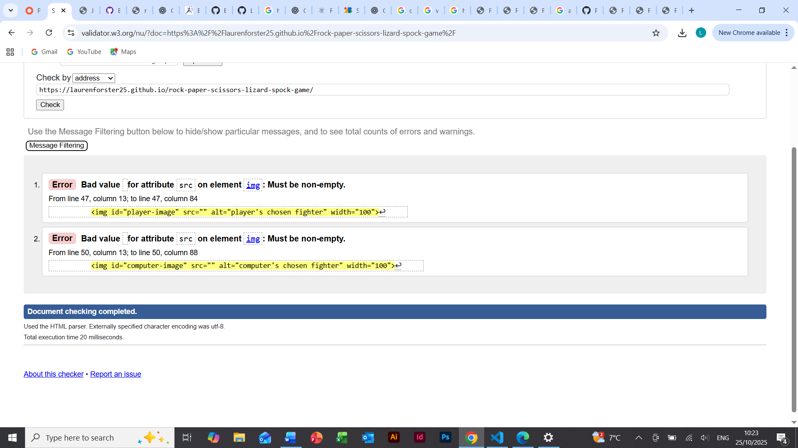
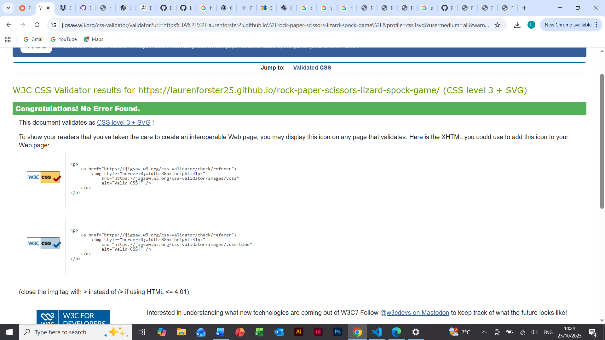
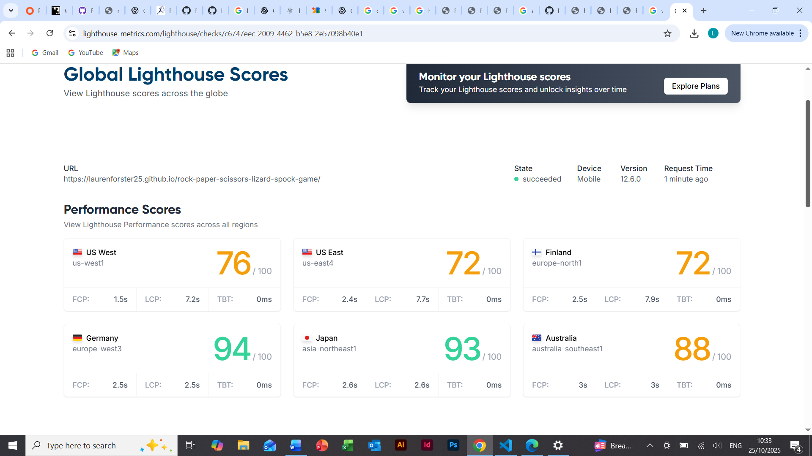

# Rock, Paper, Scissors, Lizard, Spock Game
This fun and modern twist on the original rock, paper, scissors game will engage people of all ages and backgrounds. The origins of this game comes from the American Sitcom ‘The Big Bang Theory’, and adding two more choices to the classic game gives players the chance to put their decision making skills to the test. This is a game designed to hone your quick-thinking skills and can be shown to family, friends and colleagues alike!

Playing this game in person can often result in a lot of human error (and potenital cheating!), but with the computer as your rival, the results will be fairer as the computer's choice of hand will be completely random. 

## Features

### Header
The top of the page features a bold header that describes the game to the user: Rock, Paper, Scissors, Lizard, Spock. The black colour contrasts the background and the font is simple and readable but also fun. There is an icon to the left of the header which demonstrates the hand motions one would use if they were playing the game in real life. This visual representation of the game adds to an interesting and bright design. 

### Game Options
The ‘Game Options’ section lists the five options players have to choose from, with accompanying images. Again, this is a brilliant visual aid that can engage more people in the game. It can also help users who are visually impaired as they may find the images a useful method of identification.

### Game Results
This is the largest and most interactive part of the game page. In this section we have two boxes, the box on the left displays the player’s choice of ‘fighter’ and the box on the right displays the computer’s choice of ‘fighter’. These images change with each round and reset when the player presses the ‘Restart Game’ button. Underneath the box displays, a message appears for each leg of the game, when the player wins against the computer, when they lose and when they tie. It also informs them when they restart the game. The scores of both players are situated below these messages. The Restart button is bold and colourful, enticing users to play more rounds. These features really make the game an interactive experience and are helpful to visually impaired users. 

### Game Rules
At the bottom of the page there are a set of game rules. This section explains to the user how the extra two options are incorporated into a classic game of Rock, Paper, Scissors. Having these rules clearly expressed on the page, will really allow players to use their initiative and further develop their decision making skills.

## Features to Implement in the Future
With more time I would like to increase the responsiveness of this design by inclduing more media queries. I also think adding more colour to the page could increase the enjoyment for users. In the further future, I would like to make this a game page that could be played by two people as well as just player vs computer.

## Testing 
- I tested my Javascript code through JSHint and while I did receive some warnings in regards to the availability of my code in certain extensions, there were no errors with the actual code itself.
- When inspecting my game page through Chrome's Developer tools, no error messages were raised in the console.
- I tested my HTML code through the HTML Validator and it brought up an error that I had not added a value to my src attribute. I then added a placeholder image within that source to fix the error.

- I tested my CSS code in Jigsaw, which brought up no errors.

- I also tested this game page to access its Lighthouse Performance Scores

## Bugs Solved
I faced many errors when creating this game page but I was able to correct most of them easily. 
The more common bugs occured when styling the Game Results section of the page. I realised I was styling the div itself rather than the boxes. I also had some confusion trying to link the Javascript code to the html attributes properly. This was just a case of ensuring all the id names were the same.

## Deployment
 - In order to deploy the website on GitHub, I followed the steps below:
 1. In the GitHub repository, I navigated towards the settings icon on the top right corner of the page.
 2. From there, I selected 'Pages' from the left-hand side bar.
 3. I ensured that the source was set to 'Deploy from Branch', the Main branch was selected and that the folder was set to Root.
 4. I then clicked save and waited for the wesbite to be deployed.
 5. GitHub then provided me with a URL for the newly deployed website.

This is my deployed site: https://laurenforster25.github.io/rock-paper-scissors-lizard-spock-game/

## Credits 
- While I was mostly able to fix the the bugs in my code, there was some code snippets that I was unsure about and borrowed from my tutors:
let computerChoice = Math.floor(Math.random() * choices.length);
let result = chooseWinner(choices[playerChoice], choices[computerChoice])
- These snippets were taken from the Project Portfolio 2 Scope Video

- I would also like to thank my tutors for their efforst in helping me when I asked for it. I also used github

## Media 
-I found all of my images from Google.

